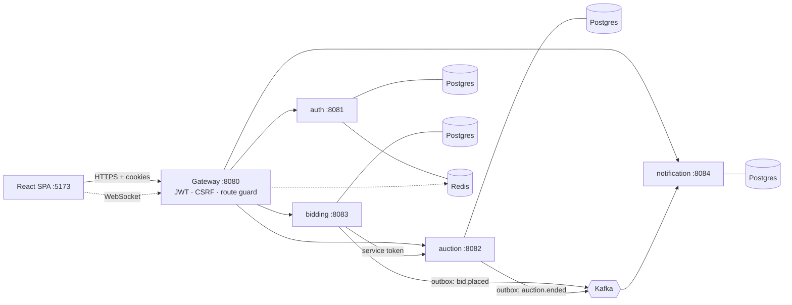

# Rostra

A real-time auction platform built as event-driven microservices. Sellers list items, bidders compete, and prices and notifications update live.

Built to practise reliability patterns: not losing events when Kafka is down, not processing them twice, and not selling an item to two people.

**Stack:** Java 21 · Spring Boot 3 · Spring Cloud Gateway · Kafka · PostgreSQL 16 · Redis · WebSocket · React 19 · TypeScript · Tailwind 4 · TanStack Query

## Architecture



Each service owns its own database (`rostra_auth`, `rostra_auction`, `rostra_bidding`, `rostra_notification`). Services use HTTP for commands and Kafka for events.

## Authentication

- Sign-in sets two `HttpOnly`, `SameSite=Strict` cookies: a 15-minute access JWT and a 7-day refresh JWT. Refresh rotates the pair; sign-out denylists the access token in Redis.
- The gateway validates the cookie, drops any `Authorization` header, and enforces double-submit CSRF (`XSRF-TOKEN` cookie, `X-XSRF-TOKEN` header) on writes.
- Services re-verify the token locally and never call auth-service.
- Anonymous requests get `401`, forbidden ones `403`. Unauthenticated WebSocket upgrades get `401`.

## Reliability patterns

| Problem | Solution |
|---|---|
| Kafka is down when a bid is placed | **Transactional outbox**: the event is saved with the bid in one transaction, then published by a poller. Also used for `auction.ended`. |
| Kafka delivers an event twice | Consumers **dedupe** on the source event id. |
| Two bids at the same moment | **Optimistic locking** on the auction, with a retry. |
| Auction service is slow or failing | **Resilience4j** circuit breaker and retry. |
| Redis is down | Gateway checks **fail open** behind a circuit breaker. |
| Internal endpoint called from outside | Gateway blocks it, and it only accepts a short-lived `SERVICE` token. |

`scripts/demo-kafka-outage.sh` stops Kafka, places bids, restarts Kafka, and shows that nothing was lost.

## Running locally

Requires Java 21, Maven, Node 20+ and Docker.

```bash
# 1. Infrastructure: Postgres, Redis, Kafka, Kafka UI (http://localhost:8090)
docker compose up -d

# 2. Shared signing secret (see .env.example). Set it for the gateway and every service.
export JWT_SECRET="$(openssl rand -base64 48)"

# 3. Each backend module, from platform/backend/<name>/
mvn spring-boot:run

# 4. Frontend
cd platform/frontend && npm install && npm run dev    # http://localhost:5173
```

In IntelliJ, set `JWT_SECRET` in each run configuration. The Vite dev server proxies API and WebSocket paths to the gateway, so the browser sees a single origin.

## Testing

```bash
bash scripts/smoke-flow.sh          # end-to-end checks against the running stack
bash scripts/demo-kafka-outage.sh   # outbox demo
```

## Limitations and next steps

- Schema comes from Hibernate `ddl-auto=update`; Flyway migrations would be the proper fix.
- One shared HMAC secret signs all tokens; production would use asymmetric keys and mTLS.
- WebSocket sessions are in memory, so notification-service is single-instance.
- No payments: winning an auction produces a notification, not a checkout.

