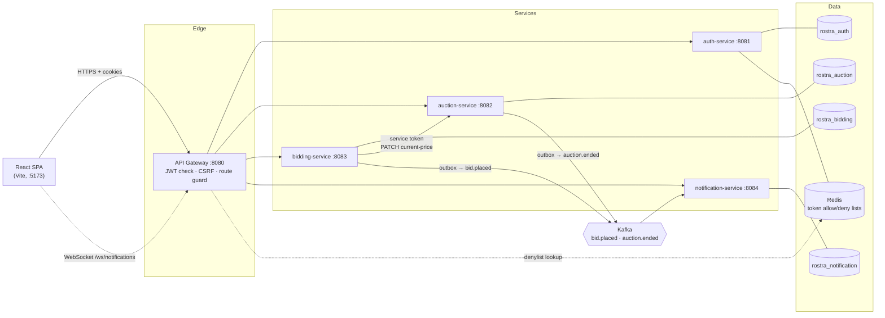
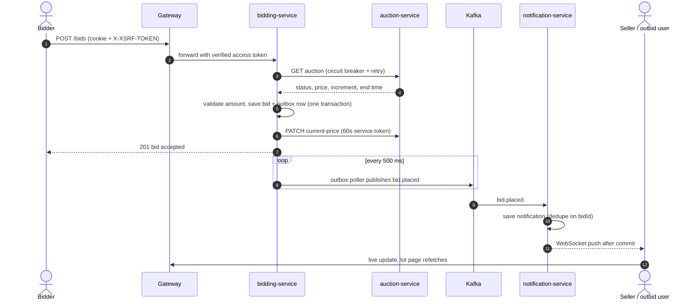

# Rostra

A real-time auction platform built as event-driven microservices. Sellers list items, bidders compete, and everyone sees prices and notifications update live.

I built it to practise the reliability patterns that matter in distributed systems: not losing events when Kafka is down, not double-processing them when they are delivered twice, and not selling an item to two people when bids arrive at the same moment.

**Stack:** Java 21 · Spring Boot 3 · Spring Cloud Gateway · Kafka · PostgreSQL 16 · Redis · WebSocket · React 19 · TypeScript · Tailwind 4 · TanStack Query

## What it does

- Sign up and sign in with cookie-based JWT sessions.
- Create auctions with a start price, a minimum bid increment and a start and end time. Auctions move from `SCHEDULED` to `ACTIVE` to `ENDED` on their own, or `CANCELLED` by the seller.
- Place bids. The highest valid bid wins, and concurrent bids are resolved safely.
- When a bid lands, the seller and the previous top bidder are notified instantly over WebSocket. When an auction ends, the winner, the seller and the losing bidders are notified.
- A live bell with unread count, an inbox, and a lot page whose price updates as bids arrive.

## Architecture



Every service owns its own database. Services never read each other's tables; they talk over HTTP for commands and over Kafka for events.

| Service | Port | Responsibility |
|---|---|---|
| `gateway` | 8080 | Single public entry point. Validates the JWT cookie, enforces CSRF, blocks internal routes, proxies WebSocket upgrades. |
| `auth-service` | 8081 | Sign up, sign in, refresh rotation, sign out, `GET /auth/me`. |
| `auction-service` | 8082 | Auction CRUD, lifecycle scheduler (activate and end auctions), owns the current price. |
| `bidding-service` | 8083 | Validates and stores bids, bid history, publishes `bid.placed`. |
| `notification-service` | 8084 | Consumes events, stores notifications, pushes them over WebSocket. |

### Placing a bid



### Ending an auction

The auction lifecycle scheduler in auction-service closes expired auctions. It determines the winner and final price, and writes an `auction.ended` row to its own outbox in the same transaction. The notification service then tells the winner, the seller and every losing bidder (derived from the stored bid notifications).

## Reliability patterns

| Problem | How Rostra handles it |
|---|---|
| Kafka is down when a bid is placed | **Transactional outbox.** The event is written in the same database transaction as the bid, and a poller publishes it later. Nothing is lost. Same pattern for `auction.ended`. |
| Kafka delivers an event twice | Delivery is at-least-once, so the notification service **dedupes** on a source event id (`bidId` or `auctionId`). |
| Two bidders bid at the same moment | **Optimistic locking** on the auction row. The loser gets a clear conflict and can retry. |
| Auction service is slow or failing | **Resilience4j** circuit breaker and retry on the bidding to auction call. |
| Redis is down | The gateway's Redis checks sit behind a circuit breaker and **fail open**, so a cache outage does not log everyone out. Services still verify signature, expiry and token type locally. |
| Someone calls an internal endpoint from outside | The gateway refuses internal routes, and `PATCH /auctions/{id}/current-price` only accepts a short-lived `SERVICE` token minted by bidding-service. |

`scripts/demo-kafka-outage.sh` shows the outbox in action: it stops Kafka, places bids, restarts Kafka, and confirms the notifications still arrive.

## Authentication

Cookie sessions, enforced at the gateway.

- `POST /auth/signup`, `/auth/signin`, `/auth/refresh`, `/auth/signout`, and `GET /auth/me`.
- Sign-in sets two `HttpOnly`, `SameSite=Strict` cookies: a 15-minute access JWT (`access_token`) and a 7-day refresh JWT (`refresh_token`, only sent to `/auth/*`). Both carry a `jti`.
- Refresh rotates the pair. The old refresh `jti` is deleted from Redis, so replaying it fails.
- Sign-out puts the access `jti` on a Redis denylist (TTL = remaining lifetime) and deletes the refresh `jti`.
- The gateway drops any client `Authorization` header and forwards the `access_token` cookie only if the signature is valid, it is unexpired, it is an `ACCESS` token and it is not denylisted.
- CSRF uses a double-submit token: every `POST`, `PUT`, `PATCH` and `DELETE` (except sign-up and sign-in) needs an `X-XSRF-TOKEN` header matching the readable `XSRF-TOKEN` cookie.
- Anonymous requests to protected endpoints get `401`. Authenticated but not allowed gets `403`.
- Unauthenticated WebSocket upgrades are refused with `401` at the gateway.

Browser clients: send `credentials: 'include'` and copy the `XSRF-TOKEN` cookie into an `X-XSRF-TOKEN` header on writes. The frontend's `api.ts` already does this and also performs a single refresh and retry on a `401`.

## API overview

All requests go through the gateway on `:8080`.

| Method and path | Auth | Description |
|---|---|---|
| `POST /auth/signup`, `/auth/signin` | public | Create an account, start a session |
| `POST /auth/refresh`, `/auth/signout` | cookie | Rotate tokens, end the session |
| `GET /auth/me` | user | Current user |
| `GET /auctions`, `GET /auctions/{id}` | public | Browse, filter and page auctions |
| `POST /auctions`, `PATCH /auctions/{id}`, `DELETE /auctions/{id}` | user | Create, edit, cancel (seller only) |
| `GET /bids?auctionId=…` | public | Bid history, newest first, paged |
| `POST /bids` | user | Place a bid |
| `GET /me/notifications`, `GET /me/notifications/unread-count` | user | Inbox and unread count |
| `PATCH /me/notifications/{id}/read`, `POST /me/notifications/read-all` | user | Mark read |
| `WS /ws/notifications` | user | Live notification stream |

## Running locally

**Prerequisites:** Java 21, Maven, Node 20+, Docker.

**1. Start infrastructure** (Postgres with the four databases, Redis, Zookeeper, Kafka, Kafka UI at http://localhost:8090):

```bash
docker compose up -d
```

**2. Set the signing secret.** The gateway and every service refuse to start without it. Use the same value for all five services and the gateway; see `.env.example`. Never commit a real value.

```bash
export JWT_SECRET="$(openssl rand -base64 48)"          # Linux / macOS / Git Bash
# PowerShell: $env:JWT_SECRET = [Convert]::ToBase64String((1..48 | ForEach-Object { Get-Random -Maximum 256 }))
```

In IntelliJ, put `JWT_SECRET` in each run configuration's environment variables instead.

**3. Start the backend.** Run each from `platform/backend/<name>/`:

```bash
mvn spring-boot:run     # gateway, auth-service, auction-service, bidding-service, notification-service
```

**4. Start the frontend:**

```bash
cd platform/frontend
npm install
npm run dev             # http://localhost:5173
```

The Vite dev server proxies `/auth`, `/auctions`, `/bids`, `/me` and `/ws` to the gateway, so the browser only ever sees one origin and cookies just work. Set `GATEWAY_URL` if the gateway is not on `http://localhost:8080`.

## Verifying it works

```bash
bash scripts/smoke-flow.sh          # end-to-end: auth, auctions, bids, history, notifications, WebSocket, CSRF, 401/403 rules
bash scripts/demo-kafka-outage.sh   # stops Kafka, places bids, restarts Kafka, shows nothing was lost
mvn test                            # unit tests per module
```

The smoke test needs the whole stack running and prints a PASS or FAIL line for each check.

## Project layout

```
rostra/
├── docker-compose.yml          Postgres, Redis, Kafka, Kafka UI
├── infra/postgres/init.sql     creates one database per service
├── scripts/                    smoke test, Kafka outage demo, WebSocket listener
└── platform/
    ├── backend/
    │   ├── gateway/            Spring Cloud Gateway (WebFlux): JWT, CSRF, route guard
    │   ├── auth-service/
    │   ├── auction-service/
    │   ├── bidding-service/
    │   └── notification-service/
    └── frontend/               React + Vite SPA (see its README)
```

## Frontend

React 19, Vite, TypeScript, Tailwind 4. React Router for pages, TanStack Query for server state, Zustand for session and toasts. The lot page polls while open, and the WebSocket invalidates queries and shows toasts, so prices and the bell update without a refresh. See [`platform/frontend/README.md`](platform/frontend/README.md).

## Known limitations and next steps

- **Schema management:** Hibernate `ddl-auto=update` is used for convenience. It does not update enum check constraints, so a new enum value needs a manual `ALTER TABLE`. Flyway migrations are the proper fix.
- **Single secret:** one shared HMAC secret signs every token. In production I would use per-service secrets or asymmetric keys (RS256 with a JWKS endpoint) and mTLS between services.
- **WebSocket sessions are in memory,** so notification-service runs as a single instance. Scaling out needs a Redis or Kafka fan-out between instances.
- **No payments or item media.** Winning an auction produces a notification, not a checkout.

## License

MIT, see [LICENSE](LICENSE).
